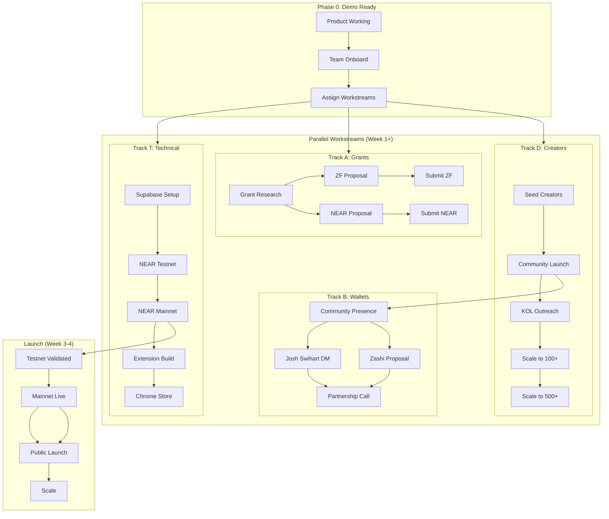
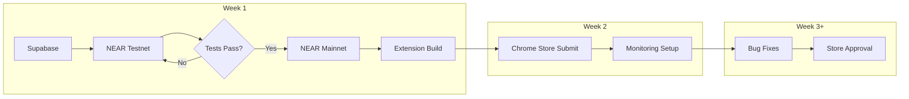
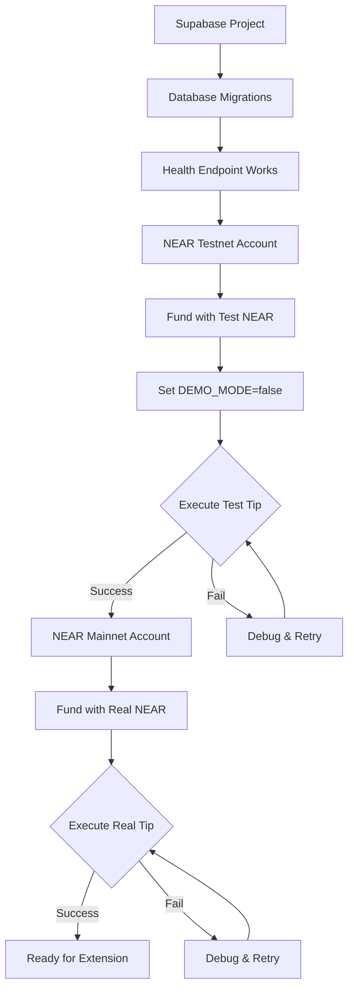
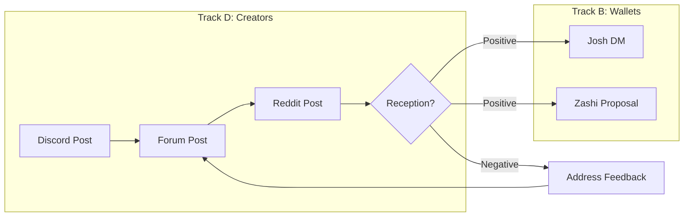
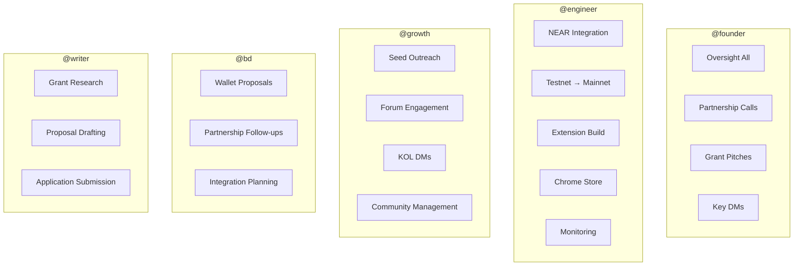
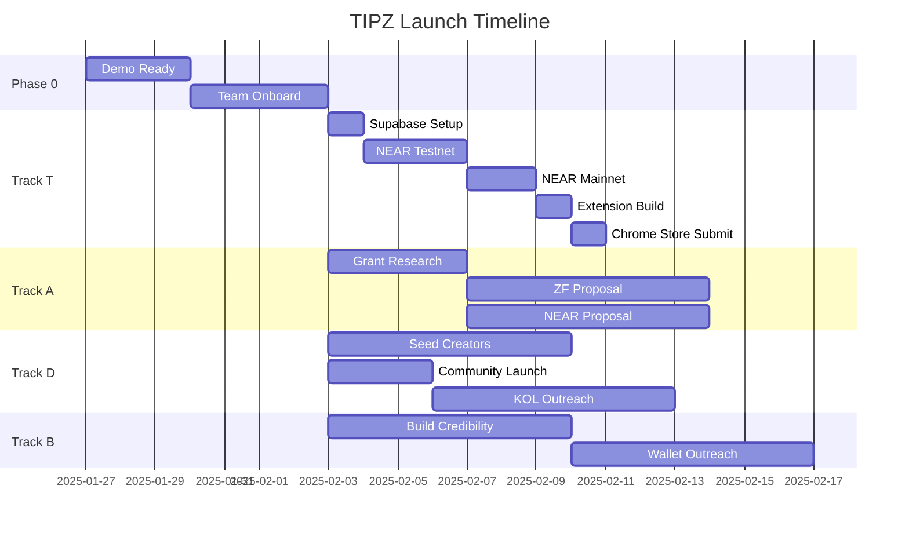
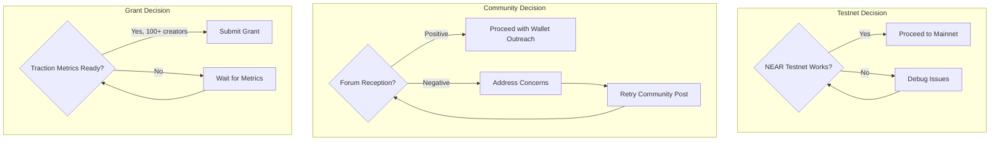
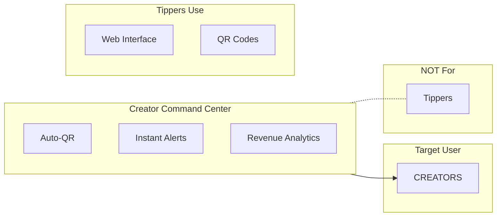

# TIPZ Launch Flowchart

> Visual reference for all workstreams and their dependencies.
> Use this to understand the critical path and where you fit.

---

## Master Launch Flow

---

## Track T: Technical Flow (Engineer)

### Critical Dependencies

---

## Track D → Track B: Community Unlocks Partnerships

---

## Owner Assignment

---

## Timeline View

---

## Decision Points

---

## Extension Context

---

## Quick Reference

| Track | Owner | Week 1 Goal | Week 4 Goal |
|-------|-------|-------------|-------------|
| T (Tech) | @engineer | Mainnet tip works | Chrome Store approved |
| A (Grants) | @writer | Research complete | 2 grants submitted |
| B (Wallets) | @bd | Community presence | 1 partnership confirmed |
| D (Creators) | @growth | 100+ registered | 500+ registered |

---

## How to Use This Document

1. **Find your track** - Look at the Owner Assignment diagram
2. **Understand dependencies** - Check the Critical Dependencies diagram
3. **Know your timeline** - Reference the Gantt chart
4. **Check decision points** - Know what gates must pass before proceeding

---

*Render these diagrams in GitHub, VS Code (with Mermaid extension), or https://mermaid.live*
